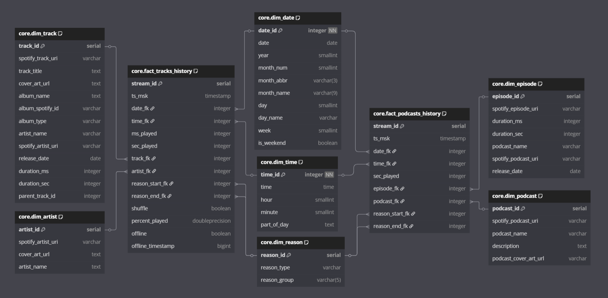

# Spotify Streaming ETL Pipeline

A custom-built data pipeline that extracts personal Spotify streaming history, enriches it via Spotify's API, transforms the data, and loads it into a star-schema PostgreSQL data warehouse. This project supports both music and podcast analytics.

---

# Tech Stack
- Python 3.12
- PostgreSQL
- Spotipy (Spotify Web API client)
- Psycopg2
- SQL (DDL, DML, time zone conversions, date normalization)
- Pytest

---

# Apache Airflow Orchestration
This project uses pure python for the main logic and orchestration, but I also made an Airflow version of the same ETL pipeline [here](https://github.com/averelli/Spotify-ETL-Airflow-Version)

---

# Project Structure

```
├── scripts/
│   ├── connectors/
│   │   └── db_manager.py
│   │   └── spotify_client.py
│   ├── etl/
│   │   ├── extractor.py
│   │   ├── transformer.py
│   │   └── etl.py
│   └── main.py               # Runs the pipeline
├── data/
│   └── raw/                  # Local Spotify export .json files
├── config/
│   ├── config.py             # Load all the env variables
│   └── logging_config.py
├── tests/                    # Pytest directory
├── logs/                    
├── docs/
│   ├── images/               
│   └── sql/                  # All DDLs + date dim generation scripts
├── README.md
├── .gitignore
├── .env
└── requirements.txt
```

---

# Features
- Extracts raw streaming data from Spotify's personal export files and inserts it into staging
- Identifies new unique tracks, episodes, artists, and podcasts
- Fetches metadata from the Spotify API in batches (handles rate limits and errors)
- Stores raw data in a staging schema (inside jsonb columns)
- Transforms and loads clean, normalized records into a star schema
- Populates fact tables with calculated fields (e.g. percent_played)
- Maintains re-runnable logic with deduplication and delta loads
- Tracks failed API responses for manual review
- Truncates staging layer after the process is done
- Every function and exception is logged to a local rotating log file

---

# Database Schemas
## Staging Layer


Staging contains 5 tables, one for the raw data extracted from jsons, and 4 tables for the raw data fetched fromt the API with the following structure:
```
Table staging.spotify_*_data {
  "record_id" serial 
  "spotify_*_uri" varchar
  "raw_data" jsonb
  "fetched_at" timestamp [default: `CURRENT_TIMESTAMP`]
  "is_processed" boolean [default: false]
}
```

## Core Layer


Core layer is designed as a star schema, with the following tables:
### Fact tables:
- `fact_tracks_history`: stores facts about streaming music
- `fact_podcasts_history`: stores facts about streaming podcasts
### Shared dimensions:
- `dim_date`: calendar from 2018 to 2030 
- `dim_time`: time dimension
- `dim_reason`: stores reasons for starting/ending a streaming session
### Exclusive dimensions for `fact_tracks_history`:
- `dim_artist`: stores data about each artists
- `dim_track`: stores data about each track. (Note: column `parent_track_id` has been removed)
### Exclusive dimensions for `fact_podcasts_history`:
- `dim_podcast`: stores data about each podcast
- `dim_episode`: stores data about each episode

## Etl Internal Layer


This layer has the following table:
- `failed_uris`: stores data about spotify URIs that returned nulls from the API

## Data Mart Layer (Work in progress)
To make the dashboard, I’ve started building out a data mart layer ([dm schema](docs/sql/dm_ddl.sql)) on top of the core warehouse tables. This layer provides pre-aggregated views and convenience functions for analytics and Wrapped-style reporting.

### Current Components

- `dm.parent_tracks`: helper mapping table to unify “child” tracks with their parent albums/tracks (useful for remasters, alternate versions, etc.).

Aggregated Views:

- `dm.yearly_agg`: yearly listening summaries (hours, sessions, distinct tracks/artists)
- `dm.monthly_agg`: monthly breakdowns with the same metrics
- `dm.all_time_agg`: overall listening stats since the start of data collection

Utility Functions:
Reusable functions returning ranked tables of top content, with optional filters for year/month and configurable limits:

- `dm.top_artists(year, month, limit)`
- `dm.top_albums(year, month, limit)`
- `dm.top_tracks(year, month, limit)`

Each function outputs hours listened, raw play counts, estimated full streams, and a cover art URL for visualization in the dashboard.

---

## Dashboard (Work in progress)

I am currently building a Streamlit + Plotly dashboard on top of the data mart layer.
The goal is to create a Wrapped-style interface that lets me explore my listening history interactively, with year/month filters, drill-downs, and rich visualizations.

### Current Features
- **Global & filtered stats:** hours listened, total streams, estimated full streams, and distinct tracks/artists.
- **Interactive charts:**
  - Year-over-year bar chart of hours listened
  - Monthly breakdown with clickable bars → drill down into a specific month
- **Top charts sections:**
artists, albums, and tracks with cover art, listening hours, and play counts.

### Work in Progress
- UI/UX polish
- More stats and visualisations
- More filters
- Artist/track pages with stats

---

# Challenges faced
- Ensuring code reusability across multiple item types (tracks, artists, podcasts, and episodes).
- Batch processing while handling API rate limits and errors.
- Some Spotify API responses contain null values instead of valid track/episode data. So I had to find a way to detect, log, and retry failed URIs, and if it still fails, log it into the failed_uris table.
- Some raw tracks data has invalid or missing data inside, like a realease date set to '0000' or missing cover art URL.